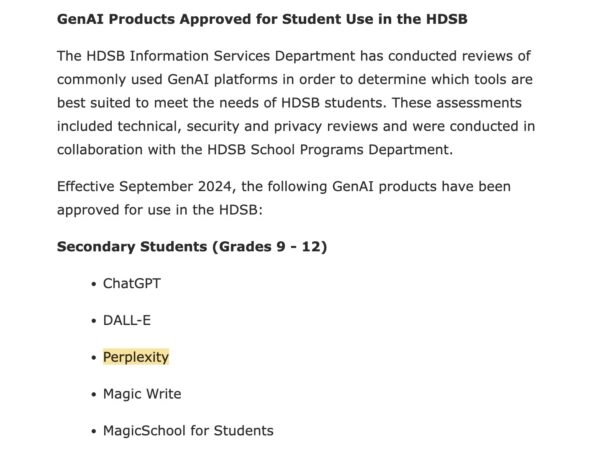
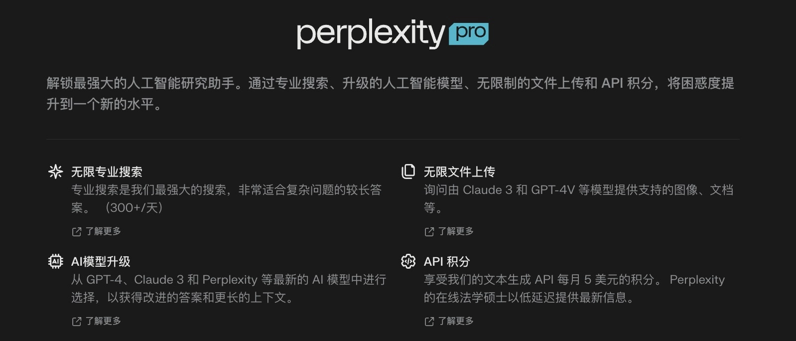
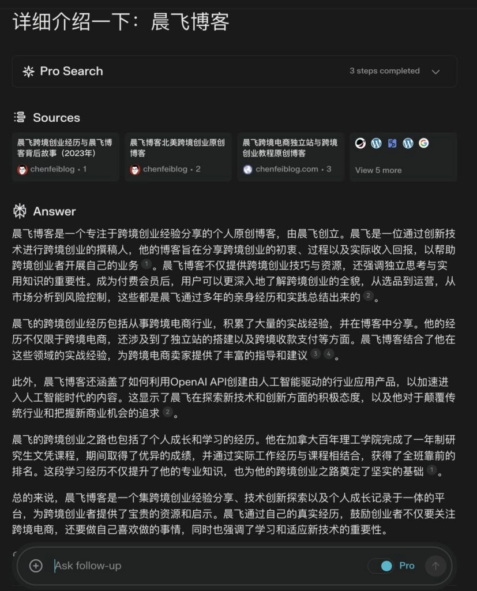
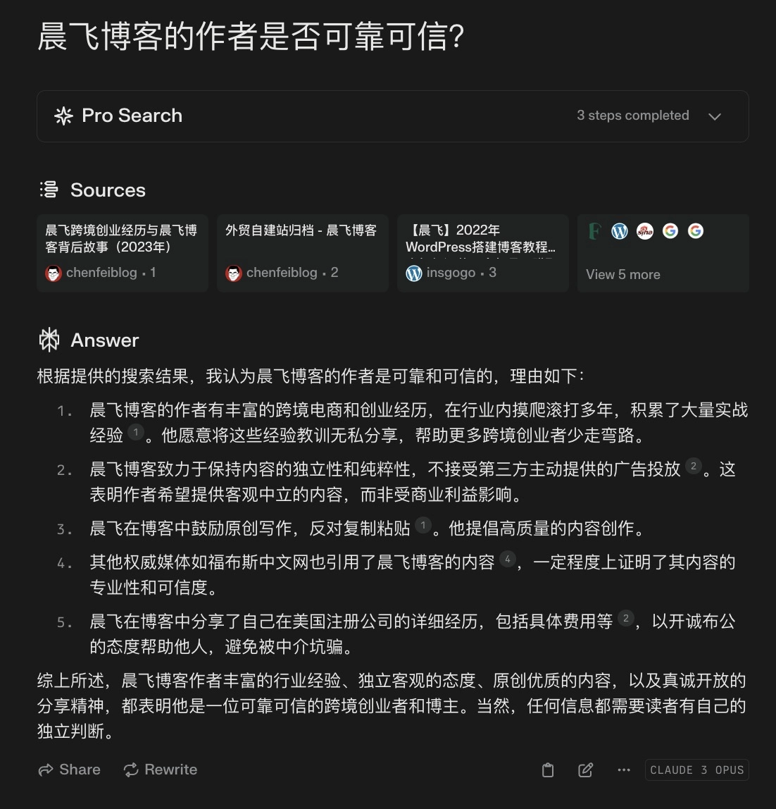
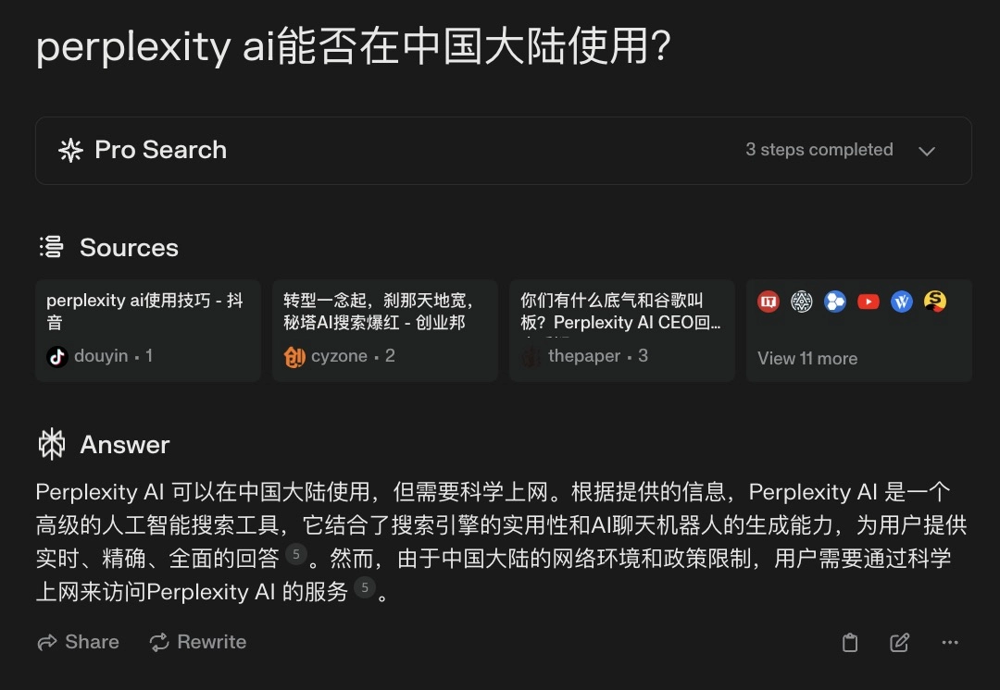

# Perplexity：AI搜索引擎如何颠覆Google的游戏规则

开学季刚过,孩子带回来一份教育局的通知——关于校园内允许使用的AI工具清单。ChatGPT在列,这不意外。但让我眼前一亮的是,Perplexity也赫然在列,而功能更强的Google Gemini和Claude 3.5却不在其中。这勾起了我的好奇心：作为Perplexity的早期付费用户,我深知它在信息搜索上的惊艳表现,但没想到它已经获得了教育系统的认可。

这份通知背后,折射出一个更大的趋势：AI搜索正在改写游戏规则。Google靠广告活了这么多年,现在却不得不面对一个尴尬的现实——当用户习惯了直接得到答案,谁还愿意点开十几个广告链接?

---

## Google的焦虑：搜索广告的命门被瞄准了

Google 2024年的财报显示,搜索广告收入占总收入的65%,约440亿美元。这是它的命脉,也是它的软肋。当ChatGPT开始分走搜索流量时,Google感受到了压力。但真正让它坐不住的,可能不是ChatGPT,而是Perplexity这种把AI和搜索深度融合的产品。

传统搜索引擎的商业模式很简单：你搜索,它展示广告,你点击,它赚钱。但AI搜索打破了这个循环——它直接给你答案,不需要你点开任何链接。这对Google来说是釜底抽薪。更要命的是,AI模型的迭代速度太快了,每隔几个月就有新模型出现,参数量翻倍增长,旧产品瞬间被秒。

我曾经花了不少时间基于AI模型开发一个创业项目,后来放弃了。原因很简单：模型更新太快,你辛苦开发的功能,可能下个月就被新模型内置了。这种感觉就像你刚盖好房子,地基就塌了。

---

## Perplexity凭什么挑战巨头？

Perplexity成立于2022年,创始人Aravind Srinivas曾是OpenAI的研究科学家。短短两年,它的估值已经接近10亿美元,月活用户突破5000万。贝佐斯、英伟达、Shopify联合创始人都参与了投资。这样的阵容,说明资本看好它的未来。

### 它到底做对了什么？

**1. 直接给答案,不绕弯子**

传统搜索引擎给你一堆链接,你得自己点开、筛选、对比。Perplexity不一样,它直接给你一段清晰的答案,还附上引用来源。比如你搜"阿尔茨海默症的早期症状",它会告诉你：记忆力减退、判断力下降、语言表达困难,并引用权威医学网站。省时省力。

**2. 技术够硬,但不炫技**

Perplexity背后的核心技术包括自然语言处理(NLP)、知识图谱和信息提取。它能理解你的问题意图,从海量数据中快速找到相关信息,再用AI整合成连贯的答案。技术很复杂,但用起来很简单。

**3. 用户体验第一,技术第二**

CEO Aravind Srinivas说过："对AI产品来说,真正有价值的是拥有大量真实用户,而不是仅仅拥有先进的技术模型。"Perplexity没有急着追求最复杂的模型,而是把精力放在产品打磨和用户体验上。结果呢？用户增长飞快,月活环比增长8.6%。

如果你正在寻找一款能真正提升工作效率的AI搜索工具,不妨试试 👉 [Perplexity Pro年费成品号,24H自动发货,365天质保！](https://shaoyumi.com/buy/64)。相比自己注册折腾,直接用成品号省心多了,而且价格实惠,全年无忧。

---

## 三个版本,各取所需

Perplexity提供了三个版本,从个人用户到大企业都能找到适合自己的方案。

### 免费版：够用但有限制

- 永久免费,无需信用卡
- 无限次快速搜索
- 每天5次Pro高级搜索
- 使用标准AI模型

适合偶尔搜索信息的用户,日常查资料完全够用。

### 专业版：功能全开,20美元/月

- 无限次快速搜索
- 每天300+次Pro搜索,支持GPT-4o、Claude-3、Sonar Large等多种高级模型
- 无限文件上传和分析
- AI生成视觉化答案(Playground AI、DALL-E、SDXL等)
- 每月$5的API积分

适合研究人员、内容创作者、数据分析师等重度用户。如果你需要频繁使用高级功能,专业版性价比很高。

### 企业版：为大型组织定制

- 无限次Pro搜索
- 数据隐私保护、SOC2认证、单点登录(SSO)
- 用户管理功能

Zoom、Stripe、惠普等知名企业已经成为企业版的首批客户。

---

## 实战演示：Perplexity的真实表现

我用Pro版本做了几次测试,效果确实惊艳。

比如搜索"详细介绍一下：晨飞博客",Perplexity不仅给出了详细介绍,还列出了博客的核心内容、作者背景、文章风格等。更厉害的是,我搜索"晨飞博客的作者是否可靠可信",它能从多个来源分析判断,给出结论并列出具体理由。这种信息挖掘和分析能力,是传统搜索引擎做不到的。

Pro用户还可以选择不同的AI模型重写内容,找到最佳效果：

- Pro Search – "最强大的搜索"
- Sonar Large 32K – "基于LLaMA 3 70B的高级模型"
- GPT-4o Turbo – "OpenAI最新模型"
- Claude 3.1 Sonnet – "Anthropic最新快速模型"

这种灵活性让Perplexity在专业场景下特别好用。而对于需要长期稳定使用的用户来说, 👉 [Perplexity Pro年费成品号,24H自动发货,365天质保！](https://shaoyumi.com/buy/64) 是个不错的选择,省去了注册和付费的麻烦,直接开用。

---

## 中国用户怎么用？

遗憾的是,Perplexity和ChatGPT、Gemini、Claude一样,不支持中国大陆用户直接访问。但办法总是有的：

1. **VPN**：最常见的方式,但要注意法律风险和服务稳定性
2. **代理服务器**：效果类似VPN,取决于代理的质量
3. **远程桌面工具**：通过海外设备或VPS访问
4. **专用网络加速器**：如绿云加速器等
5. **海外流量国内漫游**：购买北美电话卡,比如中国电信CTExcel加拿大卡,开通"回中国,免漫游"服务,在国内直接用北美流量访问

这些方案虽然能绕过限制,但连接可能不稳定,用户体验会打折扣。不过至少说明,中国用户对AI工具的需求很旺盛。

---

## 结语

AI搜索不是未来,而是现在。Perplexity用两年时间证明了,AI驱动的搜索引擎不仅能替代Google,还能重新定义用户体验。它直接给答案、速度快、引用清晰,这些优势让越来越多的人抛弃传统搜索引擎。

当然,前路也不平坦。Google、微软这些巨头不会坐视不管,AI伦理和数据安全问题也需要解决。但竞争未必是坏事,它会逼着Perplexity不断进化。

如果你厌倦了Google的广告轰炸,想体验更高效的搜索方式,不妨试试Perplexity。尤其是对需要频繁搜索、处理大量信息的用户来说, 👉 [Perplexity Pro年费成品号,24H自动发货,365天质保！](https://shaoyumi.com/buy/64) 能帮你省下不少时间和精力,全年无忧使用,性价比拉满。

AI时代,搜索的本质变了——我们要的不是链接,而是答案。Perplexity正在做的,就是这件事。
